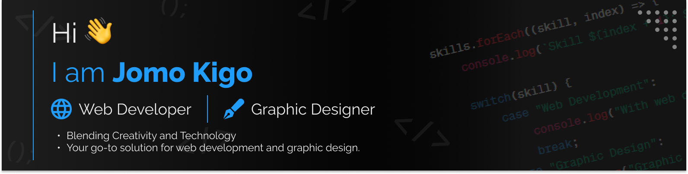

#

# 💫 About Me

🔭 I’m currently working on interior design website with react.js and tailwind 
👯 I’m looking to collaborate on web  development for businesses and brands 
🤝 I’m looking for help with UI/UX design 
🌱 I’m currently learning system design 
⚡ Fun fact, sleep schedule is a myth 😂

## 🌐 Socials

   

# 💻 Tech Stack

                   

# 📊 GitHub Stats

 

##

 

##

#

## 🏆 GitHub Trophies

#

### ✍️ Random Dev Quote

---

### 🔝 Top Contributed Repo

---

